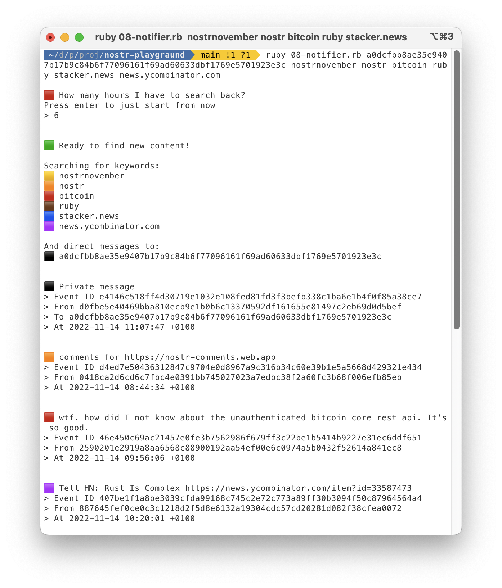

# Nostr Ruby playground

A series of simple progressive Ruby scripts to learn how to interact with the [Nostr Protocol](https://github.com/nostr-protocol/nostr) following the [NIPs](https://github.com/nostr-protocol/nips).

## Basic learning

01. How to generate a key pair

02. Convert keys to/from npub/nsec [Damus](https://github.com/damus-io/damus) Bench32 format

03. Generate pub key from a private one and check it against a reference

04. Create an event and check it against a reference

05. Post an event to Nostr

06. Post a direct message to a Nostr user

## Interactive scripts

07. Let's chat with another user!

08. Be alerted for new content or private messages

The scripts contain a test key pair, feel free to update it to test.
To experimenting with events creation is suggested to use a local relay, you can find many implementations at [awensome-nostr](https://github.com/aljazceru/awesome-nostr).